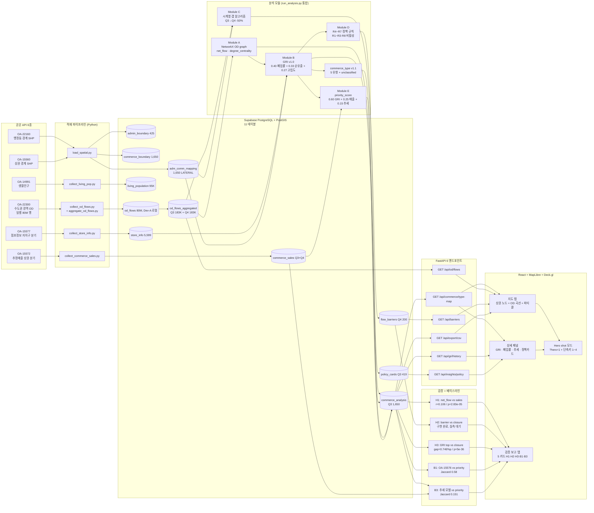

# spiceMap 데이터 결합 구조도 (D-9, 2026-05-03)

> 발표 산출물 1장 — 공공API 6종 → PostGIS 11테이블 → 분석 모듈 5종 → API 6종 → 프론트
> 출처: `backend/models.py` · `docs/schema.md` · `backend/api/*.py` · `frontend/src/`

## 전체 파이프라인

## 핵심 수치 (D-9 시점)

| 단계 | 지표 |
|------|------|
| 공공 API | 6종 (OA-22300/22160/15560/14991/15577/15572) |
| 적재 row 수 | 80M+ (od_flows 원본), 366K+ (분기 집계), 1,650 (상권 폴리곤) |
| 분석 분기 | 2025Q3 + 2025Q4 (동등 척도, Q3·Q4 비율 0.94~1.05) |
| 분석 모듈 | A·B·C·D·E + commerce_type v1.1 |
| 검증 | H1·H2·H3 + 베이스라인 B1·B3 |
| 정책 규칙 | R4·R5·R6·R7 활성 (R1~R3·R8 보류) |
| API | FastAPI 6 엔드포인트 (Redis 1h 캐시) |
| 프론트 테스트 | 178/178 vitest, build 2.0MB / gzip 562KB |
| 백엔드 테스트 | 228 pass |
| MVP 범위 | 강남구·관악구 — 1,650 상권 중 178 (강남 104 + 관악 74) |

## 차별화 포인트

1. **흐름 기반 위험 탐지** — 기존 상권분석은 *상태 스냅샷*만, spiceMap은 *왜 그 상태가 됐는가(흐름 단절)*까지
2. **자동 정책 카드** — 규칙 기반(R4~R7) + 생성형 AI 미사용 라벨 (FR-07)
3. **이중 베이스라인 검증** — 공식 OA-15576(B1, J=0.58) + 단순 매출 추세(B3, J=0.151) 모두 우월
4. **Hero shot 시연 동선** — `?hero=1` + 단축키 1~4 → 4클릭 안에 가치 입증
